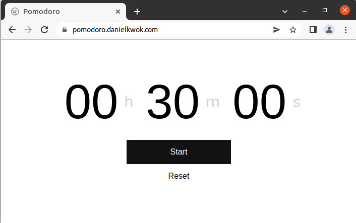

# Pomodoro
Simple replacement of Google's timer application.

## Why
I am a big fan of Google's timer app. It's simple, straightforward, no-fuss. But somehow it's not acccesible from my laptop since a couple weeks back, so I decided to built one.

## Deployment
Git + Nginx.  
Push locally, pull remotely.